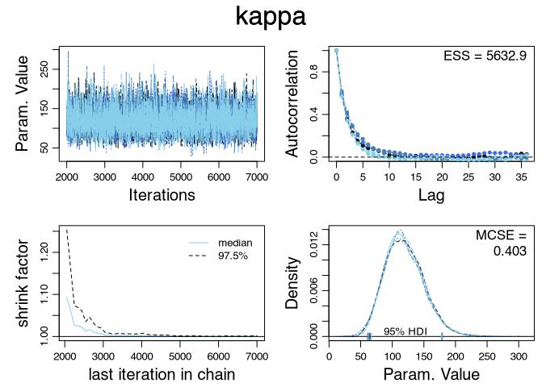

### Introduction

Autism spectrum disorder (ASD) is a disorder that affects how people interact with the world around them. Usually, it presents itself as difficulty interacting or communicating with others and repetitive behaviors (Geschwind, 2025). ASD is typically detected in children before the age of 2, and can vary in terms of symptoms and their intensity (Mayo Clinic, 2025). Although it has no cure, early detection and treatment can be extremely effective in helping children succeed. 

As autism detection techniques advance, different countries have different approaches as to how they study and treat autism. Our purpose in this project was to try and find if there is a true difference in autism prevalence internationally. By knowing the true prevalence of autism in a country, that country may be able to better allocate resources to help support those with autism.


---


### The Data Set

The data set we will be using is the Autism Prevalence Studies data set collected by the U.S. Department of Health and Human Services and made accessible by Marilia Prata through Kaggle, and can be accessed through the following link: https://www.kaggle.com/datasets/mpwolke/cusersmarildownloadscsv-1csv. It contains information from various peer-reviewed autism prevalence studies conducted around the world. The requirements for a study being included in this compilation were that the study was conducted in English, that it produced at least one autism prevalence estimate, and that the study was population based within a defined geographic area. The way the data was collected varies from study to study, but the most common methods include in-person,mailed, or online surveys, and collecting health, government, or educational records.  In order to collect all of this data, a PubMed search was conducted to identify studies published at any time through September 2020 using the search terms: autism (title/abstract) OR autistic (title/abstract) AND prevalence (title/abstract) (Prata, 2023). The data set includes studies from 44 countries, and the variables we will be focusing on and using in our calculations are the country where the study took place, the sample size of the study, and the number of cases of autism found in the study. We will also limit ourselves to studies published from the year 2000 onward.


---


#### Load and clean the dataset 

```{r}
library(tidyverse)
library(ggplot2)
library(bayesrules)
library(rjags)
library(coda)
df <- read.csv("Autism Studies Dataset.csv")

df_clean <- df[!is.na(df$Sample.Size) & !is.na(df$Number.of.Cases), ]

df_clean$y <- df_clean$Number.of.Cases
df_clean$n <- df_clean$Sample.Size
df_clean <- df_clean %>% mutate(Proportion = y/n)

#changing name of some countries
df_clean$Country <- recode(df_clean$Country, USA = "United States of America")
df_clean$Country <- recode(df_clean$Country, "Basque Country, Spain" = "Spain")
df_clean$Country <- recode(df_clean$Country, "Caribbean" = "Aruba")

#limiting dataset to 2000 and onward
df_clean <- df_clean %>% filter(Year.Published>=2000)
df_clean$country_factor <- fct_reorder(df_clean$Country, df_clean$Proportion, .fun = 'mean')
df_clean$country_index <- as.numeric(df_clean$country_factor)

#only selecting necessary variables from dataset
df_clean <- df_clean %>% select(Country, y,n, Proportion, country_factor, country_index)
ggplot(df_clean, aes(x = reorder(Country, Country, function(x) length(x)))) + geom_bar(fill = "lightblue") + geom_text(stat='count',aes(label=..count..)) + coord_flip() + ggtitle("Number of Studies by Country") + ylab("Frequency") + xlab("Country") 
```

After cleaning and filtering the data for studies published after 2000, we are left with 144 studies. Most of these studies come from the United States, with England and Canada following in frequency. All 144 studies in our clean data set will be used to try and calculate the autism prevalence rate in each respective country. We will be using JAGS and a hierarchical Beta-Binomial model for our calculations.


---


Prepare data for jags 

```{r}
# data for JAGS
y <-  as.integer(df_clean$y) #number of cases
n <- as.integer(df_clean$n) #number of samples
x <- length(y)
n_groups <-  length(unique(df_clean$Country))
country_index <- df_clean$country_index
```


Here, we build the basic model where each country's observed cases follow a binomial distribution. We assume the true prevalence rate for each country is unknown, and we give it a flat (uniform) prior, meaning we don't assume anything ahead of time, because we want to let the data speak for itself.

```{r}
library(rjags)


model_string <- "model{

  # Likelihood
  for (i in 1:x){
    y[i] ~ dbinom(theta[country_index[i]], n[i])
  }

  # Prior
  for (j in 1:n_groups){
    theta[j] ~ dbeta(mu * kappa, (1 - mu) * kappa)
  }
  
  
  # Hyperprior, phi=(mu, kappa)
  #uninformative prior for mu and kappa
  mu ~ dbeta(1, 1)
  kappa ~ dgamma(1, 0.1)
}" 

data_list <- list(y=y, n=n, n_groups = n_groups, x=x, country_index = country_index)
jags_model <- jags.model(textConnection(model_string), data = data_list, n.chains = 5)
update(jags_model, 1000)  # Burn-in
samples <- coda.samples(jags_model, variable.names = c("theta", "mu", "kappa"), n.iter = 5000)

```

---


### Diagnostics for MCMC Simulation

```{r}
source("DBDA2E-utilities.R")
#diagMCMC(samples, saveName = "diagMCMCproject",saveType = "jpg")
#DbdaAcfPlot(samples)
#DbdaDensPlot(samples)
```



After generating 5 chains and burning in 1000, the MCMC diagnostics are above. We can see that the MCMC algorithm is working, as the trace plot kind of looks like a "hairy caterpillar". We can also see that the MCSE is very close to 0 (meaning that the run-to-run variability of the estimates very small). The ESS value is 3558.1, and since the value is so large, we can assume that the estimates do not vary much from run-to-run. The shrink factor is also close to 1, meaning that we can assume convergence.

---


```{r}
# Convert to data.frame
posterior_df <- as.data.frame(do.call(rbind, samples))


posterior_df %>%
 select(kappa, mu) %>%
 pivot_longer(everything()) %>%
 ggplot(aes(x = value, fill = name)) +
 geom_density(alpha = 0.6) +
 facet_wrap(~name, scales = "free") +
 labs(title = "Posterior Densities of Hyperparameters") +
 theme_minimal()
```

Above are the posterior densities of our hyper parameters kappa and mu. Kappa seems to be centered around 30 and Mu seems to be centered around .014.

---


## Posterior estimate of Theta + 95% Confidence Interval by Country

```{r}
# Extract artist names
countries <- levels(df_clean$country_factor)

theta_means <- posterior_df %>%
 select(starts_with("theta[")) %>%
 summarise(across(everything(), list(mean = mean, lower = ~quantile(.x, 0.025), upper = ~quantile(.x, 0.975)))) %>%
 pivot_longer(everything(), names_to = c("param", ".value"), names_pattern = "theta\\[(\\d+)\\]_(.*)") %>%
 mutate(Country = countries[as.integer(param)])

# Plot: Artist posterior mean + 95% CI
ggplot(theta_means, aes(x = mean, y = fct_reorder(Country, mean))) +
 geom_point(color = "steelblue") +
 geom_errorbarh(aes(xmin = lower, xmax = upper), height = 0.3) +
 labs(title = "Posterior Estimate of Autism Prevalence with 95% Intervals by Country", x = "Prevalence", y = "Country") +
 theme_bw()


```

According to our confidence intervals above, most countries mean autism prevalence are under 1%, with a very small 95% posterior credible interval, with the exception of Lebanon, which has a 95% posterior credible interval of (.229,.283). The only study included from Lebanon had a sample size of 998 people with 263 of them having ASD, so we can see that the data from that study heavily influenced the posterior.

---


### Mapping the posteior estimates

```{r}
library(rnaturalearth)
library(rnaturalearthdata)
world <- ne_countries(scale = "medium", returnclass = "sf")

world_map <- left_join(world, theta_means, by = c("name" = "Country"))

ggplot(data = world_map) +
  geom_sf(aes(fill = mean)) +
  scale_fill_viridis_c(option = "plasma", na.value = "grey90") +
  labs(title = "Estimated Autism Prevalence by Country",
       fill = "Prevalence") +
  theme_bw()
```


---


This chunk plots the posterior distribution for just the first study. It shows what we believe the true prevalence rate is for that specific study after looking at the data. 
```{r}
posterior_matrix <- as.matrix(samples)

hist(posterior_matrix[, 1],
     main = "Posterior Distribution for Study 1",
     xlab = "Prevalence Rate",
     col = "lightblue", border = "white")
```


Posterior Summary for All Studies: 
Instead of looking at just one study, here we summarize the posterior results for all the studies by calculating the mean, standard deviation, and credible intervals for each estimated prevalence rate
```{r}
library(coda)

summary_stats <- summary(samples)
theta_stats <- summary_stats$statistics
theta_quantiles <- summary_stats$quantiles

posterior_summary <- data.frame(
  Mean = theta_stats[, "Mean"],
  SD = theta_stats[, "SD"],
  `2.5%` = theta_quantiles[, "2.5%"],
  `97.5%` = theta_quantiles[, "97.5%"]
)
head(posterior_summary)

```

 Plot Posterior Distributions for Multiple Studies: This chunk creates a graph showing the density curves for the first five studies’ posterior distributions. It lets us compare how different (or similar) the prevalence rates seem across studies.
```{r}

par(mfrow = c(2, 3))

for (i in 1:5) {
  
  max_value <- max(posterior_matrix[,i])
  
  hist(posterior_matrix[,i], 
       main = paste("Posterior for Study", i),
       xlab = "Prevalence Rate",
       col = "lightblue",
       border = "white",
       breaks = 20,
       xlim = c(0, max_value * 1.2))  # Zoom based on data
}


```
Estimate and Plot Overall Prevalence Rate (Pooled):Here we calculate the overall prevalence rate by pooling all the data together. We also plot it on top of the observed proportions to compare individual studies versus the pooled estimate.
```{r}
df_clean$p_hat <- df_clean$y / df_clean$n
pooled_p_hat <- sum(df_clean$y) / sum(df_clean$n)

hist(df_clean$p_hat, breaks=20, main="Observed Proportions vs. Pooled",
     xlab="Observed Prevalence", col="skyblue", border="white")
abline(v = pooled_p_hat, col="red", lwd=2, lty=2)
legend("topright", legend=paste("Pooled:", round(pooled_p_hat, 3)), col="red", lty=2)

```
Check Convergence Diagnostics: Before trusting our results, we use diagnostics to make sure the model actually converged and that the Markov chains are behaving nicely.
```{r}
gelman_diag <- gelman.diag(samples)
print(gelman_diag)

traceplot(samples[, 1:4])
```
Add a Hierarchical Beta-Binomial Model (Hyperprior):Instead of treating each study as completely independent, here we build a hierarchical model where all studies share a common Beta distribution, and we estimate its parameters (alpha and beta) too.

```{r}
#model_hierarchical <- "
#model {
#  for (i in 1:N) {
#    y[i] ~ dbin(theta[i], n[i])
#    theta[i] ~ dbeta(alpha, beta)
#  }
  
#  alpha ~ dgamma(1, 0.01)
#  beta ~ dgamma(1, 0.01)
#}
#"

#jags_model_hier <- jags.model(textConnection(model_hierarchical), data = data_list, n.chains = 3)
#update(jags_model_hier, 1000)
#samples_hier <- coda.samples(jags_model_hier, variable.names = c("theta", "alpha", "beta"), n.iter = 5000)


```
Analyzing Hyperparameters and Posterior Densities:
After fitting the hierarchical model, this code looks at the estimated values of alpha and beta and plots the posterior distributions for a few studies under the new model.
```{r}
# hier_matrix <- as.matrix(samples_hier)
# 
# alpha_post <- hier_matrix[, "alpha"]
# beta_post <- hier_matrix[, "beta"]
# 
# cat("Posterior mean of alpha:", round(mean(alpha_post), 3), "\n")
# cat("Posterior mean of beta:", round(mean(beta_post), 3), "\n")
# 
# # Plots
# par(mfrow=c(1,2))
# hist(alpha_post, main="Posterior of alpha", col="lightcoral", xlab="alpha", border="white")
# hist(beta_post, main="Posterior of beta", col="lightblue", xlab="beta", border="white")
# 
# par(mfrow=c(1,1))
# plot(density(hier_matrix[, "theta[1]"]), main="Posterior Densities (Hierarchical Model)",
#      xlab="Prevalence Rate", ylim=c(0, 2000), col=1)
# for (i in 2:5) {
#   lines(density(hier_matrix[, paste0("theta[", i, "]")]), col=i)
# }
# legend("topright", legend=paste("Study", 1:5), col=1:5, lty=1)

```
Posterior Predictive Checks (PPC):
Posterior predictive checks are like a "reality check" , we simulate new fake datasets from our model and see if they match the real-world data we observed.
```{r}
# model_ppc <- "
# model {
#   for (i in 1:N) {
#     y[i] ~ dbin(theta[i], n[i])
#     y_rep[i] ~ dbin(theta[i], n[i])
#     theta[i] ~ dbeta(1, 1)
#   }
# }
# "
# 
# data_list_ppc <- data_list
# jags_ppc <- jags.model(textConnection(model_ppc), data = data_list_ppc, n.chains = 3)
# update(jags_ppc, 1000)
# ppc_samples <- coda.samples(jags_ppc, variable.names = c("y_rep"), n.iter = 5000)
# 
# y_rep_matrix <- as.matrix(ppc_samples)
# y_rep_means <- colMeans(y_rep_matrix)
# 
# plot(df_clean$y, y_rep_means, main="Posterior Predictive Check",
#      xlab="Observed Cases", ylab="Predicted Cases", col="blue", pch=16)
# abline(0, 1, col="red", lty=2)

```

Mapping Autism Prevalence by Country:
If our dataset includes country names, we can plot the estimated prevalence rates across the world to spot geographic patterns.
```{r}
# library(ggplot2)
# library(dplyr)
# library(rnaturalearth)
# library(rnaturalearthdata)
# 
# country_means <- df_clean %>%
#   mutate(theta_mean = colMeans(posterior_matrix)) %>%
#   group_by(Country) %>%
#   summarise(MeanPrevalence = mean(theta_mean))
# 
# world <- ne_countries(scale = "medium", returnclass = "sf")
# 
# world_map <- left_join(world, country_means, by = c("name" = "Country"))
# 
# ggplot(data = world_map) +
#   geom_sf(aes(fill = MeanPrevalence)) +
#   scale_fill_viridis_c(option = "plasma", na.value = "grey90") +
#   labs(title = "Estimated Autism Prevalence by Country",
#        fill = "Prevalence") +
#   theme_minimal()


```
